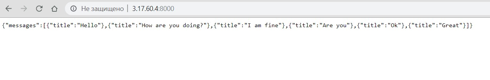

# MongoChat
Lab 9 for Distibuted Systems course

### rs.status()
```
{
        "set" : "rs0",
        "date" : ISODate("2019-10-31T00:52:06.968Z"),
        "myState" : 1,
        "term" : NumberLong(1),
        "syncingTo" : "",
        "syncSourceHost" : "",
        "syncSourceId" : -1,
        "heartbeatIntervalMillis" : NumberLong(2000),
        "majorityVoteCount" : 2,
        "writeMajorityCount" : 2,
        "optimes" : {
                "lastCommittedOpTime" : {
                        "ts" : Timestamp(1572483125, 1),
                        "t" : NumberLong(1)
                },
                "lastCommittedWallTime" : ISODate("2019-10-31T00:52:05.424Z"),
                "readConcernMajorityOpTime" : {
                        "ts" : Timestamp(1572483125, 1),
                        "t" : NumberLong(1)
                },
                "readConcernMajorityWallTime" : ISODate("2019-10-31T00:52:05.424Z"),
                "appliedOpTime" : {
                        "ts" : Timestamp(1572483125, 1),
                        "t" : NumberLong(1)
                },
                "durableOpTime" : {
                        "ts" : Timestamp(1572483125, 1),
                        "t" : NumberLong(1)
                },
                "lastAppliedWallTime" : ISODate("2019-10-31T00:52:05.424Z"),
                "lastDurableWallTime" : ISODate("2019-10-31T00:52:05.424Z")
        },
        "lastStableRecoveryTimestamp" : Timestamp(1572483075, 1),
        "lastStableCheckpointTimestamp" : Timestamp(1572483075, 1),
        "electionCandidateMetrics" : {
                "lastElectionReason" : "electionTimeout",
                "lastElectionDate" : ISODate("2019-10-30T23:38:14.667Z"),
                "termAtElection" : NumberLong(1),
                "lastCommittedOpTimeAtElection" : {
                        "ts" : Timestamp(0, 0),
                        "t" : NumberLong(-1)
                },
                "lastSeenOpTimeAtElection" : {
                        "ts" : Timestamp(1572478684, 1),
                        "t" : NumberLong(-1)
                },
                "numVotesNeeded" : 2,
                "priorityAtElection" : 1,
                "electionTimeoutMillis" : NumberLong(10000),
                "numCatchUpOps" : NumberLong(27017),
                "newTermStartDate" : ISODate("2019-10-30T23:38:15.301Z"),
                "wMajorityWriteAvailabilityDate" : ISODate("2019-10-30T23:38:15.977Z")
        },
        "members" : [
                {
                        "_id" : 0,
                        "name" : "mongo0.example.com:27017",
                        "ip" : "127.0.0.1",
                        "health" : 1,
                        "state" : 1,
                        "stateStr" : "PRIMARY",
                        "uptime" : 4543,
                        "optime" : {
                                "ts" : Timestamp(1572483125, 1),
                                "t" : NumberLong(1)
                        },
                        "optimeDate" : ISODate("2019-10-31T00:52:05Z"),
                        "syncingTo" : "",
                        "syncSourceHost" : "",
                        "syncSourceId" : -1,
                        "infoMessage" : "",
                        "electionTime" : Timestamp(1572478694, 1),
                        "electionDate" : ISODate("2019-10-30T23:38:14Z"),
                        "configVersion" : 1,
                        "self" : true,
                        "lastHeartbeatMessage" : ""
                },
                {
                        "_id" : 1,
                        "name" : "mongo1.example.com:27017",
                        "ip" : "172.31.21.2",
                        "health" : 1,
                        "state" : 2,
                        "stateStr" : "SECONDARY",
                        "uptime" : 4442,
                        "optime" : {
                                "ts" : Timestamp(1572483125, 1),
                                "t" : NumberLong(1)
                        },
                        "optimeDurable" : {
                                "ts" : Timestamp(1572483125, 1),
                                "t" : NumberLong(1)
                        },
                        "optimeDate" : ISODate("2019-10-31T00:52:05Z"),
                        "optimeDurableDate" : ISODate("2019-10-31T00:52:05Z"),
                        "lastHeartbeat" : ISODate("2019-10-31T00:52:06.870Z"),
                        "lastHeartbeatRecv" : ISODate("2019-10-31T00:52:06.146Z"),
                        "pingMs" : NumberLong(0),
                        "lastHeartbeatMessage" : "",
                        "syncingTo" : "mongo0.example.com:27017",
                        "syncSourceHost" : "mongo0.example.com:27017",
                        "syncSourceId" : 0,
                        "infoMessage" : "",
                        "configVersion" : 1
                },
                {
                        "_id" : 2,
                        "name" : "mongo2.example.com:27017",
                        "ip" : "172.31.4.18",
                        "health" : 1,
                        "state" : 2,
                        "stateStr" : "SECONDARY",
                        "uptime" : 4442,
                        "optime" : {
                                "ts" : Timestamp(1572483115, 1),
                                "t" : NumberLong(1)
                        },
                        "optimeDurable" : {
                                "ts" : Timestamp(1572483115, 1),
                                "t" : NumberLong(1)
                        },
                        "optimeDate" : ISODate("2019-10-31T00:51:55Z"),
                        "optimeDurableDate" : ISODate("2019-10-31T00:51:55Z"),
                        "lastHeartbeat" : ISODate("2019-10-31T00:52:04.969Z"),
                        "lastHeartbeatRecv" : ISODate("2019-10-31T00:52:06.277Z"),
                        "pingMs" : NumberLong(1),
                        "lastHeartbeatMessage" : "",
                        "syncingTo" : "mongo0.example.com:27017",
                        "syncSourceHost" : "mongo0.example.com:27017",
                        "syncSourceId" : 0,
                        "infoMessage" : "",
                        "configVersion" : 1
                }
        ],
        "ok" : 1,
        "$clusterTime" : {
                "clusterTime" : Timestamp(1572483125, 1),
                "signature" : {
                        "hash" : BinData(0,"AAAAAAAAAAAAAAAAAAAAAAAAAAA="),
                        "keyId" : NumberLong(0)
                }
        },
        "operationTime" : Timestamp(1572483125, 1)
}
```

### rs.config()
```
{
        "_id" : "rs0",
        "version" : 1,
        "protocolVersion" : NumberLong(1),
        "writeConcernMajorityJournalDefault" : true,
        "members" : [
                {
                        "_id" : 0,
                        "host" : "mongo0.example.com:27017",
                        "arbiterOnly" : false,
                        "buildIndexes" : true,
                        "hidden" : false,
                        "priority" : 1,
                        "tags" : {

                        },
                        "slaveDelay" : NumberLong(0),
                        "votes" : 1
                },
                {
                        "_id" : 1,
                        "host" : "mongo1.example.com:27017",
                        "arbiterOnly" : false,
                        "buildIndexes" : true,
                        "hidden" : false,
                        "priority" : 1,
                        "tags" : {

                        },
                        "slaveDelay" : NumberLong(0),
                        "votes" : 1
                },
                {
                        "_id" : 2,
                        "host" : "mongo2.example.com:27017",
                        "arbiterOnly" : false,
                        "buildIndexes" : true,
                        "hidden" : false,
                        "priority" : 1,
                        "tags" : {

                        },
                        "slaveDelay" : NumberLong(0),
                        "votes" : 1
                }
        ],
        "settings" : {
                "chainingAllowed" : true,
                "heartbeatIntervalMillis" : 2000,
                "heartbeatTimeoutSecs" : 10,
                "electionTimeoutMillis" : 10000,
                "catchUpTimeoutMillis" : -1,
                "catchUpTakeoverDelayMillis" : 30000,
                "getLastErrorModes" : {

                },
                "getLastErrorDefaults" : {
                        "w" : 1,
                        "wtimeout" : 0
                },
                "replicaSetId" : ObjectId("5dba1edca47507ce5414727b")
        }
}
```
### Recent messages screenshot

